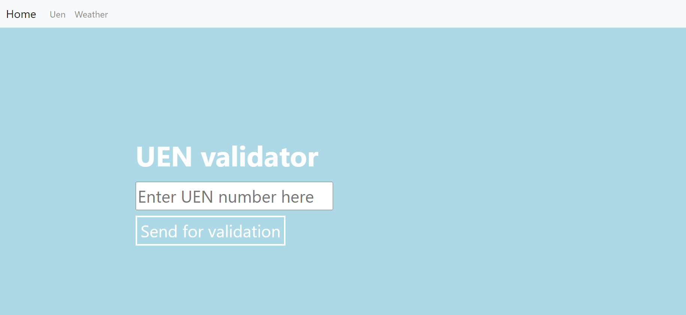
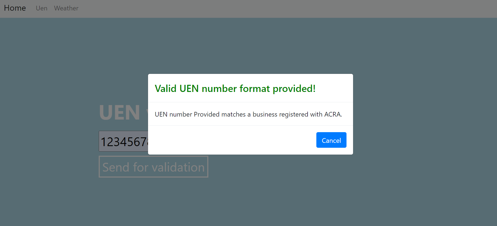
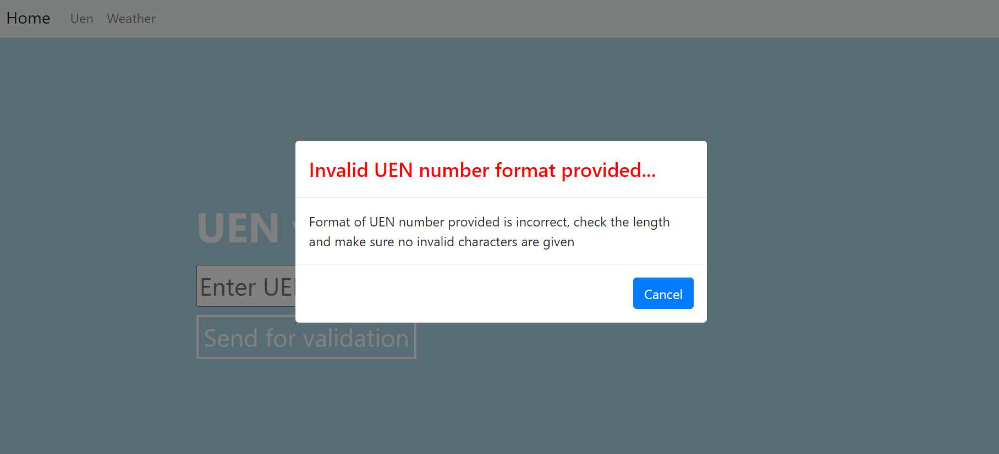
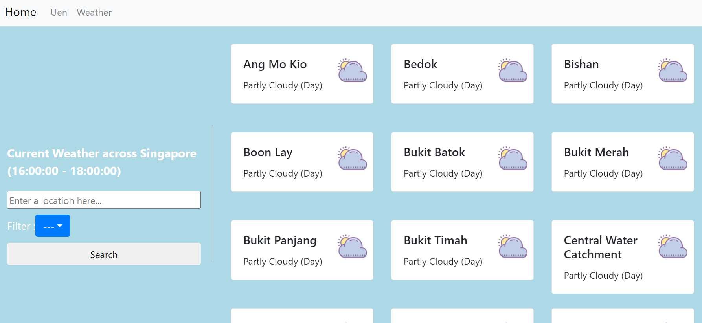
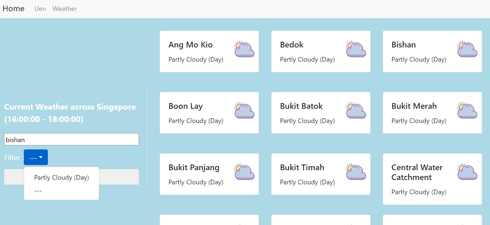
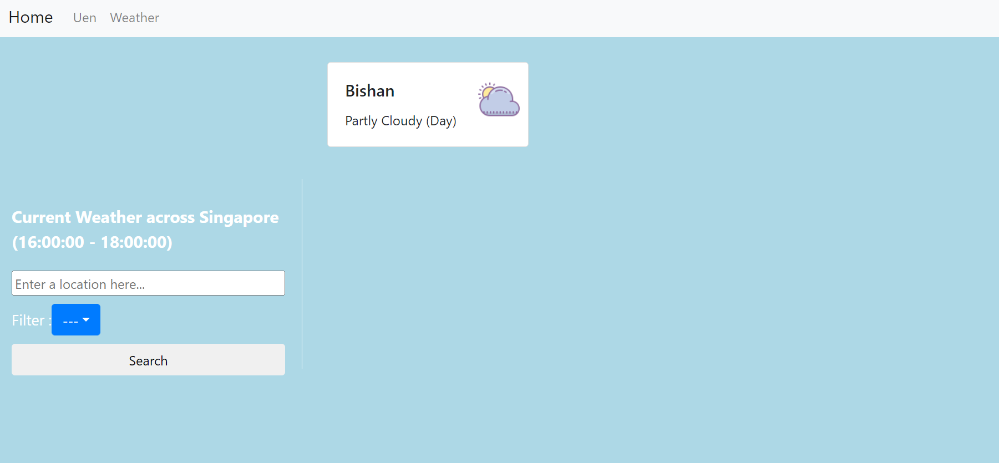
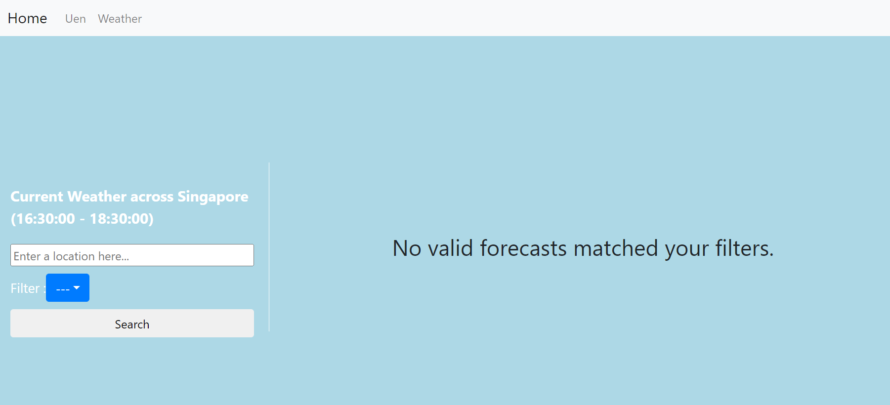

This Repository contains my solution for the following requirements.
Contents include: 
 --> Running the project
 --> Requirement #1 - Uen Validator
 --> Solution for #1
 --> Requirement #2 - Weather Forecast Retrieval
 --> Solution for #2

 Running the Project
==========================================================
Run the Project
1. clone this repository onto your local machine
2. cd into the server folder 
3. if this is the first time running the service, please run the command 'npm run setup'
4. if this is not the first time, simply run 'npm start' from the server folder

If the project fails to run using the commands above, kindly follow the steps below
1. cd into server and run 'npm run dev'
2. open another terminal
3. cd into client and run 'npm start'

Additionally, test cases have also been added for the backend. 
1. To view, please cd into server and run 'npm test'

Once the project runs, the following screen should be displayed.

Requirement #1 - Uen Validator
==========================================================
User will input an UEN. Verify the string comply with the correct format. Based on the site, there are 3 different kinds of UEN number.
1. Business ACRA number
2. Local Business ACRA number
3. Other Entities UEN number

The following assumptions were used for determining the UEN type and validity.
1. UEN numbers will have 9 to 10 alphanumeric characters.
2. The last character of the UEN number will be an alphabet.
2. For Business ACRA number, the first 8 characters are numeric.
3. For Local Business ACRA number, the first 4 characters represent the year and should be less than the current year. The remaining characters, except for the last, should be numeric.
4. For Other Entities, the first alphabet will be between "R" to "T". The next 2 characters need to numeric. The following 2 characters represent the entities and need to match the list provided by the site. The remaining characters will be numeric.

Solution for #1
==========================================================

An input field has been provided for users to enter and trigger validation endpoint.
On success, a modal box with the UEN type would be displayed for users.

If the UEN number provided has a wrong format (e.g presence of non-alphanumeric symbols), a modal box with the error message will be displayed.

Requirement #2 - Weather Forecast Retrieval
==========================================================
User is able to choose/enter a valid location in Singapore to know its weather forecast.
The following assumptions were used for determining the content to be displayed.
1. User would only need to know the forecast for the 2 hours from the current time. 
2. User will be filtering the data with either the location name and/or the weather conditions only.
3. Any set of data without a forecast will be removed. 

Solution for #2
==========================================================
The left side of the screen provides an interface for users to interact with data.
The right side will display the forecasts obtained from NEA's api.

User will be able to enter any location name. Any matching strings will return a valid data. (e.g 'is' will match for 'Bishan')
Also, the dropdown list will be populated by available weather conditions. '---' is the default field.

If there are matches with the user filter conditions, the right side will be updated.

Otherwise, the error message will be displayed instead.

